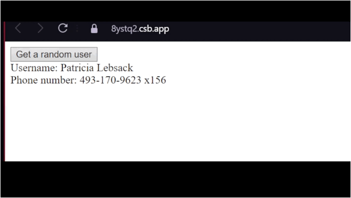

# cacheUser_app
**Welcome to RandomUser Viewer 🌟**

🎉 **Features** 🎉
- Fetch and display random user data.
- Throttle button to control API requests.
- Cache user info for faster browsing.

💻 **Tech Stack**
- Built with **React** and **TypeScript**.
- Utilizes custom _useThrottle_ hook for smooth interactions.
- Efficiently manages local state with _useState_, _useEffect_, and _useMemo_.
- Stored cached users in _localStorage_ for a seamless experience.

🚀 **Getting Started**
1. Clone the repository.
2. Install dependencies with `npm install`.
3. Start the development server using `npm start`.
   
